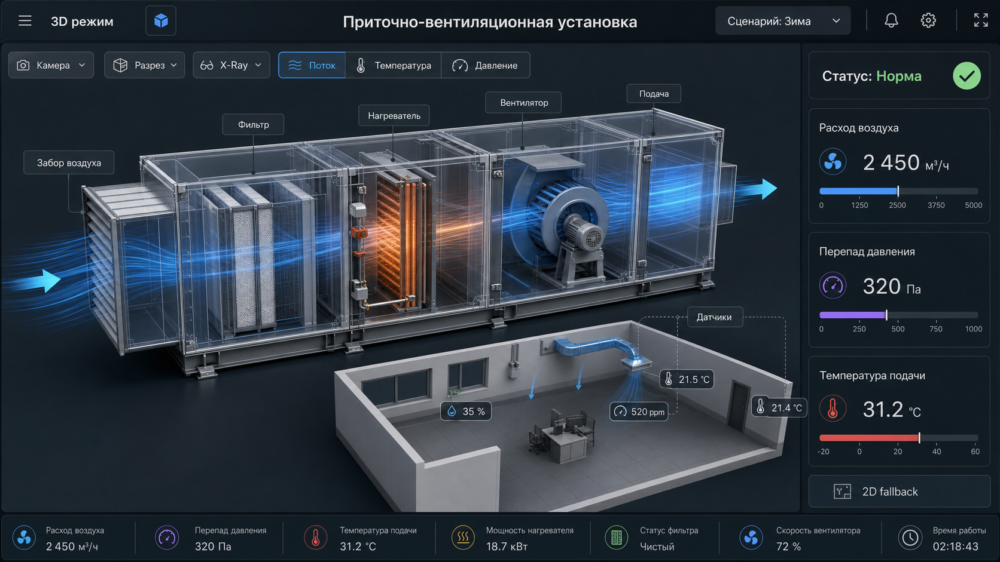
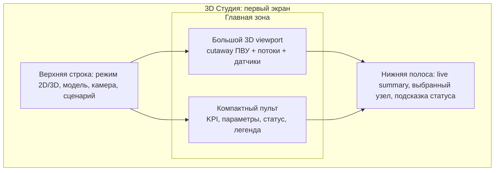
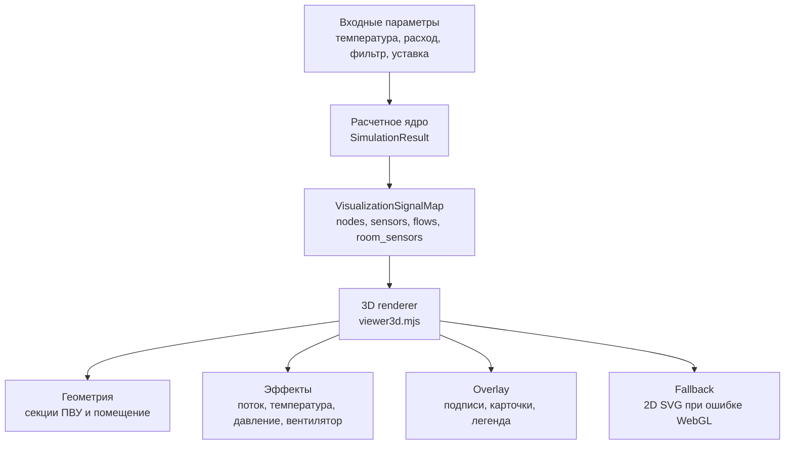
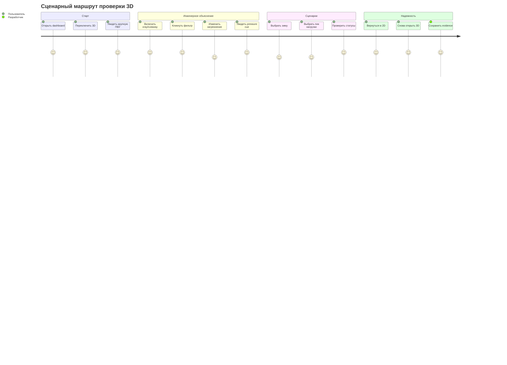

# Визуальная карта курса 3D-визуализации

Дата: 2026-05-02.

## Финальный ориентир

## Карта движения

```mermaid
flowchart LR
    A["Текущий 3D-прототип<br/>модель, room, сигналы, fallback"] --> B["Phase 0<br/>зафиксировать цель и baseline"]
    B --> C["Phase 1<br/>крупный viewport и спокойный dashboard"]
    C --> D["Phase 2<br/>секции ПВУ, cutaway, xray"]
    D --> E["Phase 3<br/>потоки, температура, давление"]
    E --> F["Phase 4<br/>датчики, подписи, interaction"]
    F --> G["Phase 5<br/>сценарный показ и UX-полировка"]
    G --> H["Phase 6<br/>performance, cleanup, fallback"]
    H --> I["Phase 7<br/>QA, screenshots, docs"]
    I --> J["Целевой результат<br/>инженерная 3D-сцена для защиты"]
```

## Целевой экран

## Смысловые слои сцены

## Матрица визуального языка

| Слой | Что показывает | Источник данных | Визуальный прием |
| --- | --- | --- | --- |
| Узлы ПВУ | Intake, filter, coil, fan, dampers, supply | `nodes` | материал, подсветка, cutaway |
| Датчики | температура, давление, расход, room sensors | `sensors`, `room_sensors` | anchors, labels, click cards |
| Потоки | направление и интенсивность воздуха | `flows.*.intensity` | streamlines, скорость, прозрачность |
| Температура | холодный/нейтральный/теплый режим | state + parameters | blue -> neutral -> amber gradient |
| Давление фильтра | рост сопротивления | `filter_pressure_drop_pa` | violet/amber pressure cue |
| Статус | Норма / Риск / Авария | `OperationStatus` | зеленый / желтый / красный |

## Контрольные кадры

## Правило курса

Каждая визуальная правка должна отвечать хотя бы на один вопрос:

- где находится физический узел установки;
- какой параметр сейчас влияет на этот узел;
- почему статус стал `Норма`, `Риск` или `Авария`;
- как пользователь может проверить это кликом, сценарием или скриншотом.
